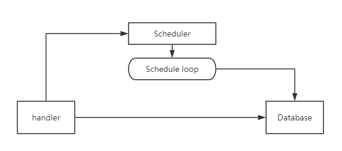
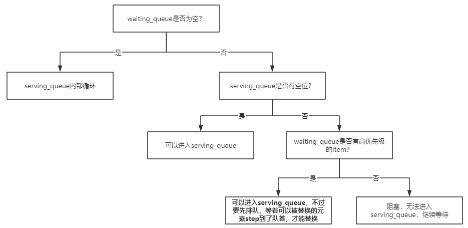

# bupt hotel management system

<p align="center">
    <a href="./README_EN.md">Read this in English</a>
</p>

波普特廉价酒店管理系统，北京邮电大学2023年秋季-软件工程-课程设计。

> 用心做好一件事。

> 在软件开发的生命周期中，软件维护才是耗时最多的环节。

这虽然是2023年秋季的软件工程课程设计，但是至今仍在维护，我看到了有很多后人star这个仓库，说明它还在发挥它的作用。维护这个仓库，做好一份代码，是一件很有意义的事情。

# 分支说明

您目前正在：**backend Python分支**

> 运行本代码的最低Python版本要求是**Python 3.10**，因为代码中使用到了`match ... case`, `asyncio`等语法。低于3.10的版本**无法运行**。

# News

+ **[2024-09-14]** 计划重写Python后端，舍弃旧的Flask + pymysql框架，选用FastAPI + asyncio + Tortoise ORM & aiosqlite.
+ **[2024-04-11]** 新增golang后端，对协程提供更好的支持。
+ **[2023-12-17]** 完成Python后端的搭建，完成基于Vue的前端的初步搭建。

# Quick Start
## -1. 前言
> **请严格按照：启动后端-启动前端-启动checkin的顺序执行。**

这是因为，我们前端在启动的时候，会自动给后端发送请求，获取信息：到底有哪些房间，每个房间的情况怎么样？以便前端进行渲染那些grid、box等组件。

如果先启动了前端，再启动的后端，那么可能会无法渲染，也就无法打开酒店管理面板。

## 0. 创建环境

在这里仅仅需要创建虚拟环境即可：


```bash
python -m venv hotel_venv

# windows
./hotel_venv/Scripts/activate
# linux/macos
source hotel_venv/bin/activate

# 安装必要的包
pip install tortoise-orm aiosqlite fastapi uvicorn loguru requests
```

## 1. Python backend启动方案

```bash
cd backend_py
python api_server.py
```

1. 启动之后，会自动对数据库进行一系列初始化，无需担心数据库的问题。
2. 在启动过程中，遇到什么缺的包直接`pip install`即可。


### 1.2 __前端启动：__

> **注意：在启动前端之前，必须先启动后端。原因见上方**

```bash
cd frontend
npm run dev
```

**注意：** 你需要安装一些packages，这个可以通过`node.js`安装，遇到缺失的直接`npm install`就行。


### 1.3 进行checkin

为了方便，我们每次都是通过一份脚本进行checkin的，而不是手动去前端那里戳戳戳

启动checkin脚本的指令：

```bash
cd tests
python checkin.py
```

注意，一定要在启动后端之后，再执行checkin脚本。


### 1.4 测试脚本

为了验证我们的系统到底怎么样，我们有一份测试脚本。

根据老师给出的样例，对服务器进行测试

脚本启动指令:

```bash
cd tests
python SE-TEST.py
```

之后会生成一份`result.xlsx`文件作为输出结果（如果运行顺利的话）


# 技术栈详情
+ Vue3 (axios, element-plus)
+ Python backend: FastAPI + asyncio + Tortoise ORM

# 任务分析
## 1. 波普特酒店管理系统宏观分析
波普特酒店管理系统这个任务，本质上是一个`IO bound`的系统，也就是说可能系统的bottleneck大多数都在IO上面（与数据库进行IO）.既然是一个IO Bound的task，一门支持协程的语言是很有必要的。

协程本质上的思想，就是在一个协程挂起的时候，去执行另一个协程。比如：

+ `A`协程遇到了`网络请求IO`，或者`数据库IO`任务，需要等待（等待其他组件完成工作，比如说网络接受response，或者等待数据库完成操作，对于我们的程序本身来说，自己只是在等待）
+ 这是无意义的等待，这个等待时间我们完全可以执行其他事情。因此这个时候，我们会选择把`A`协程挂起。
+ 执行：挂起`A`协程，执行`B`协程
+ 等`A`协程完成了IO，我们再切回来，执行`A`协程后续的代码段

这就是协程最基本的思想，通过挂起IO等待中的协程，计算其他协程的任务，以提高整个系统的并发量，从而提高请求的吞吐量。

所以选用一门对协程有很好支持的语言，对于我们的任务是至关重要的，我们主要使用了Python + Golang这两门语言。

__为什么？__

+ 避免选择小众的语言，比如说Elixir其实也是一门很不错的语言，可惜它的设计思想一般人无法理解，也很难上手，所以不选择
+ 时间花在刀刃上：不用浪费时间去学一门xx语言，大家时间都很宝贵。选用一门完成这个课设，也得考虑到今后自己的发展、就业趋势，浪费时间学一门看似正确的语言，在一个很长的时间维度上，被证明是错误的。
+ “Why not Rust？” 请Rust布道者立刻关闭本页面。

## 2. 软件工程课设需求与测试接口说明

我们考虑到软件工程这门课程对于波普特廉价酒店管理系统的核心要求：

+ **时间片调度、以风速为优先级**

最初觉得这个需求特别奇怪，因为整个时间片调度的核心原因是风速：高风速的优先调度（优先满足）。我们认为可能仅仅是老师想构建一个**可以被调度的依据**，至于这个依据的可行性、科学性，都是不考虑的。

所以有了这样一个怪异的需求，我们也只能尽可能满足。

所以我们在软件工程课设的跨组联调的时候（多个不同的组互相发送请求测试），我们为了保证多组内能够顺利完成联调、处理接口，定义了一套公用的、公开的接口：

https://apifox.com/apidoc/shared-14253c1e-942e-4899-a2ce-56f935bf571a

这个接口文档中，我们没有定义一些数据库查询接口、自身的前后端接口（我们认为那些都是可以组内自行确定的，不属于公共的联调内容），只定义了通用的、所有人都要满足的接口。

后人在开发过程中，也可以依据该API接口文档进行开发，这样如果后面又遇到跨组联调的场景，不至于手忙脚乱。

## 3. 数据库表的设计

在设计数据库表之前，我们先要思考哪些操作会用到数据库：

1. 从交互层面来看，用户的入住、退房、开启空调、关闭空调、调整温度、调整风速、主动查询房间信息；会用到数据库。
2. 从后端的调度层面来看：被时间片调度到`serving_queue`里面的房间，会计费；在`waiting_queue`中的房间，不会被计费。

我们设计：


__一、用户表__

|     字段名     |   类型   |                             备注                             |
| :------------: | :------: | :----------------------------------------------------------: |
|       id       |   int    |                          主键，自增                          |
|  client_name   |  string  |                           用户名字                           |
|   client_id    |  string  |                         用户身份证号                         |
|  room_number   |   int    | 用户房间号（注意这个房间号不是用户自己选择的，而是系统分配的，毕竟没有人在入住的时候可以选择到底是哪个号码）（同时这个也是一个**foreign key**） |
| check_in_time  | datetime |                   用户入住时间（自动写入）                   |
| check_out_time | datetime |                         用户离开时间                         |
|      bill      |  float   |                           用户账单                           |


这个表格的主键为id，无实际意义


__二、房间表__

|   字段名    |  类型  |                     备注                      |
| :---------: | :----: | :-------------------------------------------: |
| room_number |  int   |                     主键                      |
|   status    | string | 房间的状态，有“available”, “occupied”两种状态 |
|    speed    | string |  房间风速，有“high”, “medium”, “low”三种状态  |
| temperature | float  |                 房间当前温度                  |


__三、详单表__

在软件需求说明书中，明确指出了：需要前端提供一个详单表，那么我们在这里在后端把详单进行记录。

详单的意思是：每一个操作对应的扣费数额。具体来说有以下字段：


|   字段名    |   类型   |                             备注                             |
| :---------: | :------: | :----------------------------------------------------------: |
|     id      |   int    |                      主键，自增，无意义                      |
| client_name |  string  | 入住人的名字：因为后面还会第二个住户入住这个房间，产生操作，所以为了区分，每个操作都要绑定一个用户的名字，这样才具有特异性，否则就会重复。 |
| room_number |   int    |                            房间号                            |
|   op_type   |  string  | 因为详单这里我们只记录空调开销，所以操作类型也只有**针对空调风速操作**的几种，至于其他的，什么房费、什么饮料费其他杂项费用，**不在此记录。**所以操作类型有：“high”，“medium”，“low”，分别代表空调的三种风速。开空调默认为medium风速。所以开关空调、调整空调风速，都会在这里有操作的记录。 |
| start_time  | datetime |                                                              |
|  end_time   | datetime | 不可以为空。我们程序中会维护一个数据结构，它负责记录每一个操作的起始与结束。只有一个操作结束了之后，会被记录到这个表格中。对于正在serving而没有结束的状态，会在程序中的数据结构里面做记录，不能落到这个持久化层来。 |
|    amount   |  float   |                         改操作的账单                         |


这个表格有两个操作来源：第一个是用户自己的行为（调整风速之类的），第二个是后端的行为：时间片调度，会不停地对这个表格新增记录进来。

## 4. 调度设计：Scheduler内部的数据结构
我们维护一个scheduler，这个scheduler负责迭代每一步的`step`。同时这个scheduler运行在另一个线程中。

scheduler内部会动态维护几个数据结构：

| 被维护的Data Structure |                             说明                             |
| :--------------------: | :----------------------------------------------------------: |
|     `ServedRooms`      | 哈希表，`key`是房间号，`value`是一个字典：房间的风速：`high`, `medium`, `low`三种状态。房间的温度：浮点数。还有一个`last_operation_time`，记录上一次在风速上有变动的。 |
|    `serving_queue`     |              当前轮到**应该提供送风**的房间队列              |
|    `waiting_queue`     |                  当前**等待送风**的房间队列                  |
|       `db_queue`       |    是一个自己用的小型queue。用来存放需要更新的房间信息。     |


---


`serving_queue`和`waiting_queue`中存放、流动的，是结构体`ScheduleItem`。

`ScheduleItem`的定义如下:

|  结构体成员   |   说明   |
| :-----------: | :------: |
| `room_number` |  房间号  |
| `start_time`  | 开始时间 |
|  `end_time`   | 结束时间 |
|    `speed`    | 房间风速 |


---


`db_queue`中存放的，是结构体`DBQueueItem`。

`DBQueueItem`的定义如下:

|  结构体成员   |                             说明                             |
| :-----------: | :----------------------------------------------------------: |
| `room_number` |                            房间号                            |
|   `op_type`   |           操作类型，有`temperature`和`speed`两种。           |
|  `op_value`   | 操作值，如果是`temperature`，则值就是用户新设置的温度值，为了统一，在这里以字符串传递。如果是`speed`，那么值就是`high`, `medium`, `low`中的一个。 |
| `start_time`  |                           开始时间                           |
|  `end_time`   |                           结束时间                           |


## 5. 调度算法：Scheduler的调度算法设计

我们整个程序一共有两个线程，一个是主线程，另一个是Scheduler线程。

在启动程序的时候，这两个线程会同步启动。这两个线程的沟通，通过一个全局变量`schedule_task_queue`来进行。

具体来说，主线程接受外部请求，自己进行封装、处理、转化为一个`SchedulerTask`结构体，放入这个`schedule_task_queue`中。

为了避免主线程直接访问，做了个wrapper function：

```python
# wrapper function, 避免主线程直接操作schedule_task_queue
def add_task_to_queue(task: ScheduleTask):
    with task_queue_lock:  # 加锁
        schedule_task_queue.append(task)  # 添加任务到队列
```


介绍一下`SchduleTask`结构体内部的成员：

|  结构体成员   |                             说明                             |
| :-----------: | :----------------------------------------------------------: |
| `room_number` |                            房间号                            |
|   `op_type`   |           操作类型，有`temperature`和`speed`两种。           |
|  `op_value`   | 操作值，如果是`temperature`，则值就是用户新设置的温度值，为了统一，在这里以字符串传递。如果是`speed`，那么值就是`high`, `medium`, `low`中的一个。 |


两个线程讲解：

+ 主线程：负责接收来自外部的请求，这些请求全部都化为`ScheduleTask`对象，放入`schedule_task_queue`中。**不允许来自FastAPI的请求（也就是主线程）直接对数据库进行IO操作，因为这样没有经过schedule，会导致进入未知的状态。**
+ Scheduler线程：有一个`need_step()`方法，判断是否需要进行step，如果返回true，就会调用`step()`方法。
    + `step()`方法首先会先锁住`task_queue`，不允许主线程继续往这个里面添加任务，相当于阻塞住。
    + 然后自己从`task_queue`中把所有的`ScheduleTask`对象取出来，更新`ServedRooms`哈希表，把每个房间需要更改的地方更改了。同时把**改变温度**的`ScheduleTask`转换一下，放到`db_queue`中。
    + 然后解锁对`task_queue`的占有状态，允许主线程往里面添加task。避免长时间阻塞主线程。
    + 现在状态已经更新了，那么就开始调度`Scheduler`，以风速为优先级，更新`serving_queue`和`waiting_queue`。从`serving_queue`里面`pop`出来的`schedule_item`，全都记录上结束时间，然后把这个schedule_item转化一下，放入`db_queue`中。
    + 最后再进行持久化操作：把`db_queue`中的数据依次pop出来，写入数据库，保证最终清空`db_queue`。


决定是否`step()`的关键是：是否有需要时间片的需求，如果有，则step，如果没有，就不需要step了。因为你不能保证所有操作都能在一个tick内执行完，你也不能保证tick到了之后，step的调用是否会堆积。

> 设置两个queue的长度为3和2，因为这是验收时候的标准。


__案例__

如果我的房间是**高风速**，正在被serving，这个时候我突然把风速调为了medium，在程序里面应该是一个怎样的状态呢？

首先递交到请求侧——请求线程封装为schedule_task——scheduler线程开始step，锁住task_queue，读取到task，解包，更新底层的RoomServe哈希表——更新serving_queue——大概率这个时候，房间已经从serving_queue中被踢出了（因为风速优先级太低了），然后被转化为了DBQueueTask，放入DBqueue——`step()`函数尾部：把DBQueue一一出队，持久化到数据库中。

---


## 6. 调度算法：调度算法运行讲解

**有且仅有**调整风速的时候，会被scheduler调度。（也就是说：调整温度并不会被调度）

这个是按照**风速大小**进行调度的（因为要求的是以风速为优先级）。

风速越大，优先级越高。比如说如果有high存在的话，有可能medium和low都会被挤占，甚至hunger（这是文档规定的）。

这是什么意思呢？

+ 假设现在有五个房间，三个高风速，一个中风速，一个低风速。
+ 假设serving_queue的大小为3，waiting_queue的大小为2，那么这个时候会有：
  + Time 0: 高1 - 高2 - 高3；中1 - 低 1
  + Time 1: 高2 - 高3 - 高1；中1 - 低 1
  + Time 2: 高3 - 高1 - 高2；中1 - 低 1
+ 看懂了吗？这就是hunger：中、低风速的房间，永远都不会被serving，因为风速的优先级不够高。

**我们只负责实现与执行代码工程，不负责质疑老师的要求。这也就是文档中写得清清楚楚的需求。**

当task_queue里面有任务的时候，我们从中读取任务，然后进行调度。任务先出队，然后决定它在serving_queue中还是在waiting_queue中。

---


我们的整体流程是：



任何一个元素，在最初的时候都是在waiting queue当中。之后会被调度进入running queue。

整体调度的决策树是：



这里要讲解一下具体的情况，也就是每一次step的逻辑树是怎样的：

首先判断waiting_queue是否为空，因为没有的话，就直接在serving_queue中自行迭代就行：
+ 如果waiting_queue为空，serving_queue内部迭代即可。
+ 如果waiting_queue不为空，就需要判断serving_queue是否有空位：
  + 如果serving_queue有空位，就**先**把waiting_queue的第一个元素放入serving_queue中，**然后**serving_queue内部迭代。注意这个先后顺序。
  + 如果serving_queue不为空，就判断是否会发生抢占的情况：
    + 如果waiting_queue中有元素的风速是高于serving_queue，或者等于的。这个时候就触发了swap条件。不过注意：不是立马swap的！要等到那个元素被step到了队首，才能进行swap。
    + 如果waiting_queue中没有元素的风速优先级是高于serving_queue中元素的，就干等着，俗称`hunger`。

可以举几个小例子说明：

假设我们serving_queue的大小为3，waiting_queue的大小为2.

__场景一：__

queue: `[3] - [3] - [ ], [1] - [ ]`

现在serving queue中有两个对象，还有一个slot空位，waiting_queue又有一个待serve的，这个时候直接进来就行。**但是需要注意的是：先让waiting_queue的元素先进来，然后再让serving_queue的元素进行step，这样可以保证数理上的和睦性。**

那么一次step之后，queue变成：`[3] - [1] - [3], [ ] - [ ]`

__场景二：__

queue: `[3] - [2] - [3], [2] - [ ]`

这个时候的情况，就是会发生swap了。也就是waiting_queue中的那个2与serving_queue中的那个2优先级是一样的，所以他们两个要进行挤占，轮流来。

**但是并不是直接swap的，要等到serving_queue中的那个2被step到队首，即将出队的时候，才能进行swap。**

那么按照这个逻辑推理，

第一次step:

queue: `[2] - [3] - [3], [2] - [ ]` 这个时候这个2还是没有进来，只是serving_queue自己在step。

第二次step:

queue: `[3] - [3] - [2], [2] - [ ]` 这个时候这个2已经进来了。waiting_queue里面的那个2是swap下来的。

**为什么会这样？为什么不直接swap呢？**

因为，我们step的逻辑是一次只在`serving_queue`里面出队一个、入队一个。并且我们只判断队首的元素到底去哪个队列。队首的元素只有两个去向：

+ waiting_queue中没有可替换的，就从serving_queue中出来，然后又append到serving_queue的队尾。
+ waiting_queue中有可替换的，就从serving_queue中出来，到waiting_queue里面去。

这个逻辑的要点是：我们每次只对队首的元素进行判断。**至于在队列中间的，即便可以被swap，挤占，我们也不管，继续step它，直到它到了队首的时候，我们再对它进行考察。**

这样做，是为了避免程序逻辑的复杂性。试想：如果在一次step中，要对不同情况进行判断，每一次step出入队的元素不止一个，那这样的情况就会非常复杂，也没有数理层面的和平性可言。并且调试难度极大、极有可能出现bug。


# 写在后面

前端部分有很多没有完成的，因为是助教验收，所以三两下糊弄过去就完事。

+ 登陆页面（为了联调，登陆改为前端自己的事情，但是实际上应该是与后端联合的，那段代码被我注释掉了，取消注释应该就可以运行）
+ 各种面板
  + 前台面板：有一些结账逻辑没有完善、比如说checkout之后，房间的清空之类的。
  + 管理员面板：至今unfinished，我也不想管了
  + 经理面板：查看日报、周报的功能，这里应该用前端狠狠渲染出一份很好看的图表的，但是我们完全没做，甚至那份前端的路由都没创建，后端也没有对应的接口，可以说这部分几乎为0.
+ 各种美化工作
  + 我的前端界面在各种八仙过海一般的前端界面中，勉强算是能看的，归功于`element-plus`提供的组件库，让我不用太考虑布局样式之类的，也能勉强看得顺眼。
  + 但是实际上如果肯花时间的话，这部分的美化工作一定是可以做的很好的。

选择Python语言作为后端，有很多不同的原因：

+ 有了`asyncio`的Python在IO方面有不错的效果，并不输于其他语言的速度。
+ 我们谈论`速度`，是一个很粗糙的概念。是CPU密集型的任务？还是IO密集型的任务？任务的Bottleneck到底在哪里？离开业务谈速度，完全就是扯淡。在`酒店管理系统`这个任务中，明显是一个IO密集型的场合，你用C++，golang，Java，甚至是JS，其实性能上根本拉不开差距。尤其是有了FastAPI这种框架，本人亲自试过，比我用C++写的后端还要快一点。我也不知道为什么，可能是我C++写得太菜了吧。不过在这个任务中，Python作为后端语言已经完全足够了。
+ 本人是AI专业的学生，用Python相对来说熟练度更高。
+ 本人非常讨厌OOP，也不知道为什么软件工程这门课程基本上是基于、面向OOP开设的。比起面向对象，我更倾向于函数式编程。这也是为什么我在这份文档中，屡次强调`数理上的和睦`，a software can be better if it reaches the harmony of mathematics.代码里面出现的`class`，都是我使用`pydantic`的`BaseModel`声明一个数据模型用的，用C++的话说，叫`结构体`。如果你也在寻找一份**函数式编程**、**非OOP**的bupt-hotel-management项目，这个项目应当是最佳实践。

选择`tortoise-orm`作为ORM，有很多原因：

+ 早在2023-9的时候，这个项目就启动了，在架构选型的时候，我们选择的就是MySQL + 嵌入式sql。后来我发现这样的实践并不妥当。
+ 这个项目本身，是一个轻量级的项目，没有几个亿的数据，根本犯不着使用mysql，徒增烦恼，也增加debug心智，完全没有必要。就用sqlite就可以了。而且酒店管理系统即便是落到实践中，一天可能也就百来条数据入库出库，不用幻想什么高并发、高吞吐场景，都是多余的。这点小活sqlite完全够了，自己维护也方便。
+ 嵌入式sql语句有个问题，就是如果执行出错了，你没法做异常处理。当时因为我们不太明白这些工程实践上的道理，所以就在代码里面到处乱飚嵌入式的sql语句，有没有获取到数据？出错了怎么办？都是没有做异常处理的。我们先前的代码，您可以查阅`main`分支，那就是以前的代码。
+ `tortoise-orm` + `sqlite`，实验证明就是**best practice**。

代码fork过去自己改都行，pr我也会看，甚至你直接抄过去也没问题。

如果你觉得这份base code对你有帮助，可否帮忙点个star，帮助更多的byr！