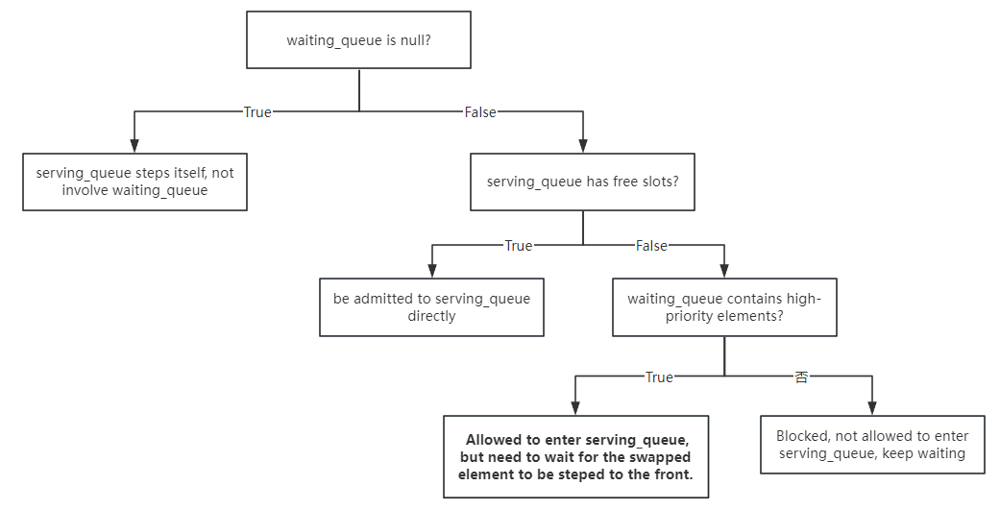

# bupt hotel management system

BUPT Hotel Management System, Beijing University of Posts and Telecommunications Fall 2023 - Software Engineering - Course Design.

> Do one thing well with all your heart.

> In the software development life cycle, software maintenance is the most time-consuming part.

Although this is a software engineering course design for the fall of 2023, it is still being maintained. I have seen many descendants star this repository, which shows that it is still playing its role. Maintaining this repository and making a good code is a very meaningful thing.

# Branch Description

You are currently in: **backend Python branch**

> The minimum Python version required to run this code is **Python 3.10** , because the code uses syntax such as `match ... case`, `asyncio`etc. Versions lower than 3.10 **cannot run** .

# News

- **[2024-09-14]** Plan to rewrite the Python backend, abandon the old Flask + pymysql framework, and choose FastAPI + asyncio + Tortoise ORM & aiosqlite.
- **[2024-04-11]** Added golang backend to provide better support for coroutines.
- **[2023-12-17]** Completed the construction of the Python backend and the preliminary construction of the Vue-based frontend.

# Technology stack details

- Vue3 (axios, element-plus)
- Python backend: FastAPI + asyncio + Tortoise ORM

# Task Analysis

## 1. Macro Analysis of BUPT Hotel Management System

The task of Poppot Hotel Management System is essentially a `IO bound`system, which means that most of the bottlenecks of the system may be on IO (IO with the database). Since it is an IO Bound task, a language that supports coroutines is very necessary.

The essential idea of coroutines is to execute another coroutine when one coroutine is suspended. For example:

- `A`The coroutine encounters a task `web request IO`or `db operation IO`needs to wait (waiting for other components to complete their work, such as the network receiving a response, or waiting for the database to complete an operation. For our program itself, it is just waiting)
- This is a meaningless wait, and we can do other things during this waiting time. Therefore, at this time, we will choose to `A`suspend the coroutine.
- Execution: Suspend `A`coroutine, execute `B`coroutine
- After `A`the coroutine completes the IO, we switch back and execute `A`the subsequent code segments of the coroutine

This is the most basic idea of coroutines. By suspending the coroutines waiting for IO and calculating the tasks of other coroutines, the concurrency of the entire system can be increased, thereby improving the throughput of requests.

Therefore, choosing a language that has good support for coroutines is crucial for our task. We mainly use Python + Golang.

**Why?**

- Avoid choosing niche languages. For example, Elixir is actually a very good language, but its design concept is difficult for most people to understand and it is difficult to get started with, so it is not a good choice.
- Spend your time wisely: Don't waste time learning a language, as everyone's time is precious. When choosing a language to complete this course, you must also consider your future development and employment trends. Wasting time learning a seemingly correct language may prove to be wrong in a long time.
- "Why not Rust?" Rust evangelists please close this page immediately.

## 2. Software Engineering Course Requirements and Test Interface Description

We consider the core requirements of the Software Engineering course for BUPT Hotel Management System:

- **Time slice scheduling, with wind speed as priority**

Initially, I thought this requirement was very strange, because the core reason for the entire time slice scheduling is wind speed: high wind speeds are scheduled first (first satisfied). We thought that the teacher might just want to build a **basis for scheduling** , and did not consider the feasibility and scientificity of this basis.

So with such a weird demand, we can only try our best to meet it.

Therefore, when we set up cross-group joint debugging in the software engineering class (multiple different groups send request tests to each other), we defined a set of common and public interfaces to ensure that multiple groups can successfully complete joint debugging and process interfaces:

https://apifox.com/apidoc/shared-14253c1e-942e-4899-a2ce-56f935bf571a

In this interface document, we did not define some database query interfaces or our own front-end and back-end interfaces (we believe that these can be determined by the group itself and do not belong to public joint debugging content). We only defined general interfaces that everyone must meet.

Later generations can also develop according to the API interface document during the development process, so that if they encounter cross-group joint debugging scenarios later, they will not be in a hurry.

## 3. Design of database schemas

Before designing the database table, we must first think about which operations will use the database:

1. From the interaction level, the database will be used when users check in, check out, turn on or off the air conditioner, adjust the temperature, adjust the fan speed, and actively query room information.
2. From the backend scheduling perspective: `serving_queue`rooms scheduled inside the time slice will be charged; `waiting_queue`rooms in the middle will not be charged.

We design:

**1. User Table**

| Field Name     | type     | Remark                                                       |
| -------------- | -------- | ------------------------------------------------------------ |
| id             | int      | Primary key, auto-increment                                  |
| client_name    | string   | Username                                                     |
| client_id      | string   | User ID number                                               |
| room_number    | int      | User's room number (note that this room number is not chosen by the user, but assigned by the system, after all, no one can choose which number when checking in) (this is also a **foreign key** ) |
| check_in_time  | datetime | User check-in time (automatically written)                   |
| check_out_time | datetime | User leaving time                                            |
| bill           | float    | User billing                                                 |

The primary key of this table is id, which has no practical meaning

**2. Room List**

| Field Name  | type   | Remark                                                       |
| ----------- | ------ | ------------------------------------------------------------ |
| room_number | int    | Primary Key                                                  |
| status      | string | The status of the room, there are two states: "available" and "occupied" |
| speed       | string | Room wind speed, there are three states: "high", "medium", "low" |
| temperature | float  | Current room temperature                                     |

**3. Detailed list**

In the software requirements specification, it is clearly pointed out that a detailed order table is required on the front end, so we will record the detailed order on the back end.

The detailed bill means: the deduction amount corresponding to each operation. Specifically, it has the following fields:

| Field Name  | type     | Remark                                                       |
| ----------- | -------- | ------------------------------------------------------------ |
| id          | int      | Primary key, auto-increment, meaningless                     |
| client_name | string   | Name of the occupant: Because a second occupant will move into this room later and generate operations, in order to distinguish, each operation must be bound to a user's name, so that it is specific, otherwise it will be repeated. |
| room_number | int      | Room Number                                                  |
| on_type     | string   | Because we only record the air conditioning expenses here, the operation types are only **for the air conditioning wind speed operation** . As for other expenses, such as room charges, beverage charges and other miscellaneous expenses, they are not recorded here. So the operation types are: "high", "medium", and "low", representing the three wind speeds of the air conditioner. The default speed of turning on the air conditioner is medium. Therefore, turning on and off the air conditioner and adjusting the air conditioner wind speed will be recorded here. |
| start_time  | datetime |                                                              |
| end_time    | datetime | It cannot be empty. We will maintain a data structure in our program, which is responsible for recording the start and end of each operation. Only when an operation is completed, it will be recorded in this table. For the status of being served but not completed, it will be recorded in the data structure of the program and cannot fall into this persistence layer. |
| amount      | float    | Change the bill of operation                                 |

This table has two sources of operations: the first is the user's own behavior (adjusting wind speed, etc.), and the second is the backend behavior: time slice scheduling, which will continuously add new records to this table.

## 4. Scheduling Design: Data Structure within Scheduler

We maintain a scheduler, which is responsible for iterating each step `step`. At the same time, this scheduler runs in another thread.

The scheduler dynamically maintains several data structures:

| Maintained Data Structure | illustrate                                                   |
| ------------------------- | ------------------------------------------------------------ |
| `ServedRooms`             | The hash table `key`is the room number, `value`which is a dictionary: the wind speed of the room: `high`, `medium`, `low`three states. The temperature of the room: a floating point number. There is also one `last_operation_time`that records the last change in the wind speed. |
| `serving_queue`           | The queue of rooms whose turn it **is to provide air supply** |
| `waiting_queue`           | The current queue of rooms **waiting for air supply**        |
| `db_queue`                | It is a small queue for personal use. It is used to store room information that needs to be updated. |

------

`serving_queue``waiting_queue`What is stored and flows in harmony is the structure `ScheduleItem`.

`ScheduleItem`The definition of is as follows:

| Structure members | illustrate      |
| :---------------- | :-------------- |
| `room_number`     | Room Number     |
| `start_time`      | Start time      |
| `end_time`        | End time        |
| `speed`           | Room wind speed |

------

`db_queue`What is stored in is the structure `DBQueueItem`.

`DBQueueItem`The definition of is as follows:

| Structure members |                          illustrate                          |
| :---------------: | :----------------------------------------------------------: |
|   `room_number`   |                         Room Number                          |
|     `op_type`     |    `temperature`There are two types of operation `speed`:    |
|    `op_value`     | Operation value, if yes `temperature`, then the value is the temperature value newly set by the user. For the sake of uniformity, it is passed as a string here. If yes `speed`, then the value is one of `high`, `medium`, .`low` |
|   `start_time`    |                          Start time                          |
|    `end_time`     |                           End time                           |

## 5. Scheduling algorithm: Scheduling algorithm design of Scheduler

Our entire program has two threads, one is the main thread and the other is the Scheduler thread.

When the program is started, the two threads will start synchronously. The communication between the two threads `schedule_task_queue`is carried out through a global variable.

Specifically, the main thread accepts external requests, encapsulates, processes, and converts them into a `SchedulerTask`structure, and puts them `schedule_task_queue`into this.

In order to avoid direct access by the main thread, a wrapper function is made:

```python
# wrapper function, avoid the main thread operate `schedule_task_queue` directly
def add_task_to_queue(task: ScheduleTask):
    with task_queue_lock:  # hold lock
        schedule_task_queue.append(task)  # append task to the queue
```

Introduce `SchduleTask`the members inside the structure:

| Structure members |                          illustrate                          |
| :---------------: | :----------------------------------------------------------: |
|   `room_number`   |                         Room Number                          |
|     `op_type`     |    `temperature`There are two types of operation `speed`:    |
|    `op_value`     | Operation value, if yes `temperature`, then the value is the temperature value newly set by the user. For the sake of uniformity, it is passed as a string here. If yes `speed`, then the value is one of `high`, `medium`, ,`low` |

Two threads explain:

- Main thread: responsible for receiving requests from the outside, all of which are converted into `ScheduleTask`objects and put `schedule_task_queue`into the main thread. **Requests from FastAPI (that is, the main thread) are not allowed to perform IO operations on the database directly, because this will not be scheduled and will lead to an unknown state.**

- Scheduler thread: There is a 

  ```python
  need_step()
  ```

  method to determine whether a step is needed. If it returns true, 

  ```python
  step()
  ```

  the method will be called.

  - `step()`The method will first be locked `task_queue`, not allowing the main thread to continue adding tasks to it, which is equivalent to blocking.
  - Then `task_queue`I `ScheduleTask`take all the objects out of it, update `ServedRooms`the hash table, and change the places that need to be changed in each room. At the same time, I convert the **temperature change**`ScheduleTask` and put it `db_queue`in.
  - Then unlock `task_queue`the occupied state of the object, allowing the main thread to add tasks to it, avoiding blocking the main thread for a long time.
  - Now that the status has been updated, we start scheduling `Scheduler`, taking wind speed as the priority, updating `serving_queue`and `waiting_queue`. All that comes out of `serving_queue`it are recorded with the end time, and then the schedule_item is converted and put into.`pop``schedule_item``db_queue`
  - Finally, perform the persistence operation: `db_queue`pop out the data in turn and write them into the database to ensure that they are cleared in the end `db_queue`.

The key to decide whether `step()`is: whether there is a need for time slices, if yes, then step, if not, then no step is needed, because you cannot guarantee that all operations can be executed within a tick, and you cannot guarantee whether the calls to step will accumulate after the tick arrives.

> Set the lengths of the two queues to 3 and 2, as these are the criteria for acceptance.

**Case**

If my room is being served with **high wind speed** , and I suddenly adjust the wind speed to medium, what should the status be in the program?

First, it is submitted to the request side - the request thread is encapsulated as schedule_task - the scheduler thread starts step, locks task_queue, reads the task, unpacks it, and updates the underlying RoomServe hash table - updates serving_queue - it is likely that at this time, the room has been kicked out of the serving_queue (because the wind speed priority is too low), and then converted to DBQueueTask and put into DBqueue - `step()`the end of the function: dequeue the DBQueues one by one and persist them in the database.

------


## 6. Scheduling algorithm: Explanation of the operation of the scheduling algorithm

The scheduler will **only schedule when the wind speed is adjusted. (That is to say, the temperature adjustment will not be scheduled.)**

This is scheduled according to **wind speed** (because the requirement is to prioritize wind speed).

The higher the wind speed, the higher the priority. For example, if high exists, it is possible that medium and low will be squeezed out, or even hunger (this is stipulated in the document).

What does this mean?

- Suppose there are five rooms, three with high wind speeds, one with medium wind speed, and one with low wind speed.
- Assuming the size of serving_queue is 3 and the size of waiting_queue is 2, then there will be:
  - Time 0: High 1 - High 2 - High 3; Medium 1 - Low 1
  - Time 1: High 2 - High 3 - High 1; Medium 1 - Low 1
  - Time 2: High 3 - High 1 - High 2; Medium 1 - Low 1
- Do you understand? This is hunger: rooms with medium and low wind speeds will never be served because the wind speed priority is not high enough.

**We are only responsible for implementing and executing code engineering, not for questioning the teacher's requirements. This is also the requirement clearly written in the document.**

When there is a task in task_queue, we read the task from it and schedule it. The task is dequeued first, and then it is decided whether it is in serving_queue or waiting_queue.

------

Our overall process is:


Each element is initially in the waiting queue and then scheduled into the running queue.

The decision tree for the overall scheduling is:



Here we need to explain the specific situation, that is, what the logic tree of each step is like:

First, determine whether the waiting_queue is empty. If not, just iterate in the serving_queue:

- If waiting_queue is empty, iterate inside serving_queue.
- If waiting_queue is not empty, you need to determine whether there is space in serving_queue:
  - If there is space in the serving_queue, put the first element of the waiting_queue into the serving_queue **first** **and then** iterate inside the serving_queue. Note the order.
  - If serving_queue is not empty, determine whether preemption will occur:
    - If the speed of an element in the waiting_queue is higher than or equal to that of the serving_queue, the swap condition is triggered. But note: it is not swapped immediately! You have to wait until the element is stepped to the head of the queue before you can swap.
    - If there is no element in the waiting_queue whose wind speed priority is higher than the element in the serving_queue, just wait, commonly known as `hunger`.

Here are a few small examples:

Assume that the size of our serving_queue is 3 and the size of waiting_queue is 2.

**Scenario 1:**

queue: `[3] - [3] - [ ], [1] - [ ]`

Now there are two objects in the serving queue, one slot is empty, and there is another object waiting to be served in the waiting_queue. At this time, it can be directly brought in. **However, it should be noted that the elements of the waiting_queue should be brought in first, and then the elements of the serving_queue should be stepped, so as to ensure mathematical harmony.**

Then after one step, the queue becomes:`[3] - [1] - [3], [ ] - [ ]`

**Scenario 2:**

queue:`[3] - [2] - [3], [2] - [ ]`

At this time, a swap will occur. That is, the priority of queue 2 in waiting_queue and queue 2 in serving_queue is the same, so they have to compete and take turns.

**However, it is not swapped directly. It has to wait until the 2 in the serving_queue is stepped to the head of the queue and is about to be dequeued before it can be swapped.**

Then according to this logical reasoning,

First step:

queue: `[2] - [3] - [3], [2] - [ ]` At this time, 2 still hasn't come in, only serving_queue itself is in step.

Second step:

queue: `[3] - [3] - [2], [2] - [ ]` At this time, 2 has come in. The 2 in waiting_queue is swapped.

**Why is this happening? Why not just swap?**

Because the logic of our step is to only `serving_queue`dequeue and enqueue one at a time. And we only determine which queue the first element goes to. The first element of the queue has only two destinations:

- If there is nothing to replace in the waiting_queue, it will come out of the serving_queue and then append to the end of the serving_queue.
- If there is a replaceable one in the waiting_queue, it will come out of the serving_queue and go into the waiting_queue.

The key point of this logic is: we only judge the element at the head of the queue each time. **As for the one in the middle of the queue, even if it can be swapped, we don't care, we continue to step it until it reaches the head of the queue, and then we examine it.**

This is done to avoid the complexity of program logic. Imagine: if you need to judge different situations in one step, and more than one element enters and exits the queue in each step, then the situation will be very complicated and there will be no mathematical peace. It will also be extremely difficult to debug and there is a high probability of bugs.


# How to Start

## -1. Introduction

> **Please strictly follow the order of: start the backend - start the frontend - start checkin.**

This is because when our front end starts, it will automatically send a request to the back end to obtain information: what rooms are there and what is the situation of each room? So that the front end can render those grid, box and other components.

If you start the front-end first and then the back-end, it may not render and you will not be able to open the hotel management panel.

## 0. Create an environment

Here you just need to create a virtual environment:

```bash
python -m venv hotel_venv

# windows
./hotel_venv/Scripts/activate
# linux/macos
source hotel_venv/bin/activate

pip install tortoise-orm aiosqlite fastapi uvicorn loguru
```

Of course, you don't have to create it, it's not that big anyway. Just install these components and you're done.

## 1. Python backend startup plan

```bash
cd backend_py
python api_server.py
```

1. After startup, the database will be automatically initialized, so there is no need to worry about database issues.
2. During the startup process, if you encounter any missing packages, `pip install`just install them directly.

### 1.2 **Front-end startup:**

> **Note: Before starting the front end, you must start the back end first. See above for the reason**

```bash
cd frontend
npm run dev
```

**Note:** You need to install some packages, which can be done by `node.js`installing them directly if you find any missing ones .`npm install`

### 1.3 Checkin

For convenience, we check in via a script each time instead of manually going to the front end.

Instructions to start the checkin script:

```bash
cd tests
python checkin.py
```

Note that the checkin script must be executed after starting the backend.

### 1.4 Test Script

In order to verify what our system actually does, we have a test script.

Test the server according to the example given by the teacher

Script startup command:

```bash
cd tests
python SE-TEST.py
```

A file will then be generated `result.xlsx`as the output (if everything goes well)

# Write at the back

There were a lot of unfinished parts in the front end, but since it was the teaching assistant's inspection, I just muddled through it and was done with it.

- Login page (for joint debugging, login is changed to the front-end's own business, but in fact it should be combined with the back-end. That code is commented out by me. It should run after uncommenting it)
- Various panels
  - Front-end panel: Some checkout logic is not perfect, such as clearing the room after checkout.
  - Admin panel: still unfinished, I don't want to manage it anymore
  - Manager panel: Check the daily and weekly reports. Here, the front-end should render a nice chart, but we didn't do it at all. We didn't even create the front-end route, and there was no corresponding interface in the back-end. It can be said that this part is almost 0.
- Various beautification works
  - My front-end interface is barely acceptable among all the other front-end interfaces, thanks to `element-plus`the component library provided, which allows me to not worry too much about layout styles and still make it look pleasing to the eye.
  - But in fact, if you are willing to spend time, this part of the beautification work can definitely be done very well.

There are many different reasons for choosing Python as the backend:

- Python has `asyncio`good performance in IO and is not inferior to other languages in speed.
- What we are talking about `speed`is a very rough concept. Is it a CPU-intensive task? Or an IO-intensive task? Where is the bottleneck of the task? It is completely nonsense to talk about speed without considering the business. In `hotel management system`this task, it is obviously an IO-intensive occasion. Whether you use C++, golang, Java, or even JS, there is actually no performance difference. Especially with the framework of FastAPI, I have tried it myself and it is a little faster than the backend I wrote in C++. I don’t know why, maybe my C++ writing is too poor. But in this task, Python is completely sufficient as the backend language.
- I am a student majoring in AI and I am relatively proficient in Python.
- I hate OOP very much, and I don't know why the software engineering course is basically based on and oriented to OOP. I prefer functional programming to object-oriented programming. That's why I repeatedly emphasize in this document `the harmony of mathematic`that a software can be better if it reaches the harmony of mathematics. The code `class`is what I use to `pydantic`declare `BaseModel`a data model, which is called in C++ `struct`. If you are also looking for a **functional programming** , **non-OOP** bupt-hotel-management project, this project should be the best practice.

There are many reasons to choose it `tortoise-orm`as an ORM:

- As early as September 2023, this project was launched. When selecting the architecture, we chose MySQL + embedded SQL. Later, I found that this practice was not appropriate.
- This project itself is a lightweight project. Without hundreds of millions of data, there is no need to use mysql. It will only cause trouble and increase debugging effort. It is totally unnecessary. Just use sqlite. Moreover, even if the hotel management system is put into practice, there may be only a hundred data in and out of the database in a day. There is no need to imagine high concurrency and high throughput scenarios. It is redundant. sqlite is completely sufficient for this small job, and it is also convenient to maintain it yourself.
- There is a problem with embedded SQL statements, that is, if an error occurs during execution, you cannot do exception handling. At that time, because we did not understand the principles of these engineering practices, we randomly threw embedded SQL statements everywhere in the code. Did we get the data? What if an error occurs? There was no exception handling. You can check `main`the branch of our previous code, which is the previous code.
- `tortoise-orm`+ `sqlite`, experiments have shown that it is **best practice** .

You can fork the code and modify it yourself. I will also review the PR. It’s even fine if you copy it directly.

If you think this base code is helpful to you, could you please give it a star to help more guys!